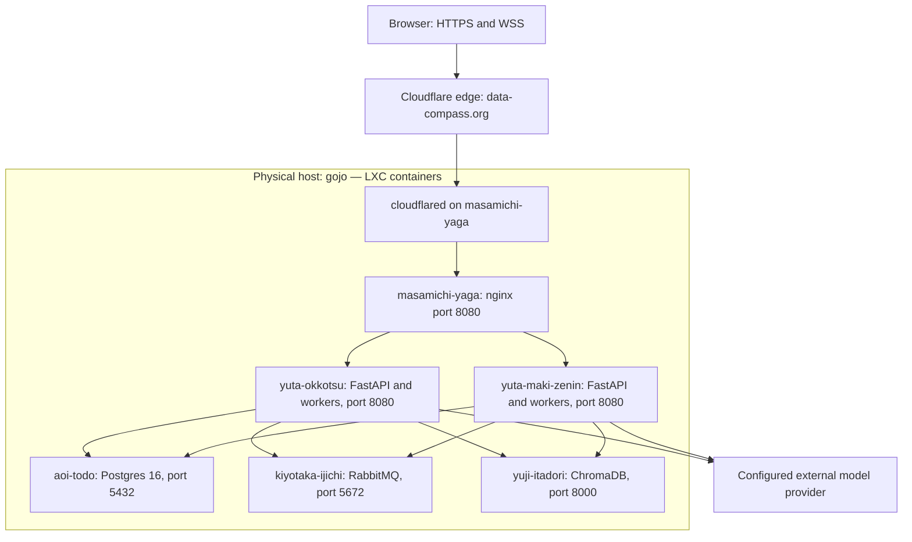
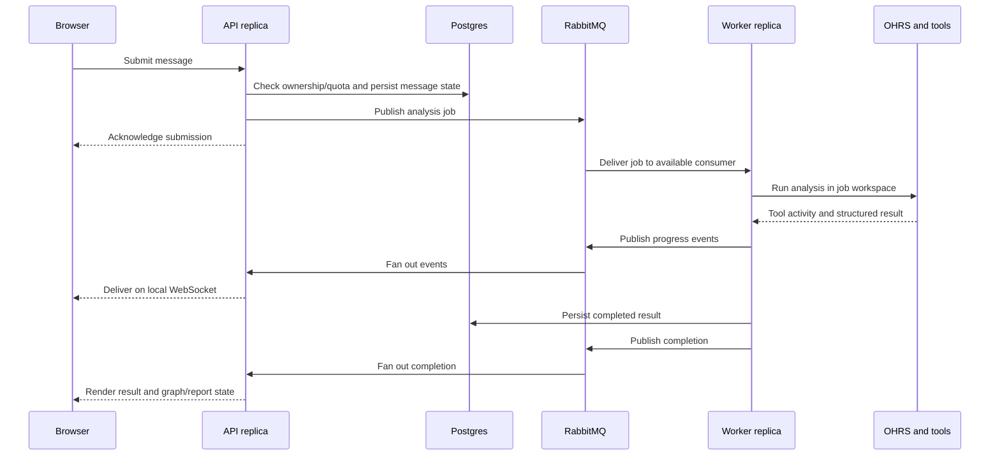

# Compass architecture

Compass is a municipal research application with conversational analysis,
source-backed reports, finding graphs, and tools for exploring Dutch municipal
data. The frontend provides chat, live agent progress, tables, charts, references,
report artifacts, sharing, and an operator dashboard.

This document describes the application and its recorded production architecture
at `data-compass.org`. The infrastructure account combines the April 2026
architecture record with the June 2026 deployment runbooks; it is not a fresh
audit of running servers. Repository behavior and configuration reflect the
Compass checkout reviewed on 2026-09-09.

See [deployment and operations](docs/deployment.md) for provisioning, code
delivery, configuration, checks, and recovery, and [runtime setup](docs/runtime.md)
for local prerequisites.

## Application and agent runtime

The application and research runtime have distinct responsibilities:

| Component | Responsibility |
| --- | --- |
| `frontend/` | React, TypeScript, and Vite application; chat, reports, graph exploration, and administration |
| `backend/` | Python 3.12 FastAPI application; authentication, sessions, jobs, streaming, persistence, and execution |
| `scripts/` | Local setup, runtime download, and data preparation helpers |
| `agent/` | Bundled research tools, skills, plugin layouts, reference snapshots, and auxiliary dashboards |
| Agent environment | Installed tool dependencies, private provider configuration, and separately populated large corpora |
| Per-job workspace | Writable execution artifacts, trajectories, and intermediate results |

The Python package is `capelle_platform`, and application settings retain the
`CAPELLE_` prefix. These identifiers are also used in service names and broker
resources. They are operational identifiers for Compass.

The backend starts with `python -m capelle_platform.main`. `AppBuilder` constructs
the configured implementations and application lifecycle. FastAPI handles HTTP
and WebSocket routes; Uvicorn serves the process. The backend also serves the
compiled frontend from `frontend/dist` beside the `backend/` directory.

OHRS runs as a subprocess for each analysis. The skills and tool source are
bundled under `agent/`; `make install-agent` installs their dependencies. OHRS,
provider credentials, large corpora, and retrieval indexes need separate setup.
See the [runtime inventory](agent/README.md).

## Production topology

The recorded topology has six named LXC containers on `gojo`: one ingress,
two application replicas, and three data services. Tailscale supplies private
connectivity and MagicDNS; provisioning also uses hostname entries where needed
to avoid resolving a service through an unintended bridge route.

Public TLS terminates at Cloudflare. The tunnel connector runs in the ingress
container and delivers HTTP to nginx on port 8080. nginx forwards requests to the
application replicas on port 8080. Database, broker, and vector-service access
uses the private network.

### Ingress: masamichi-yaga

nginx distributes HTTP requests across the `capelle_yutas` upstream pool using
round-robin routing. The recorded configuration uses passive upstream failure
handling (`max_fails=3`, `fail_timeout=30s`). The checked-in configuration seeds
`yuta-okkotsu`; provisioning adds further replicas to the live upstream list.

The proxy preserves the request host and forwarded client information. It passes
WebSocket upgrades at `/api/ws`, disables buffering there, and sets 1800-second
proxy read/send timeouts with a 10-second connect timeout. Frontend files are
served by the backend; nginx proxies the requests.

### Application replicas: yuta-*

Each replica runs `capelle-platform.service`, the frontend build, and an analysis
worker pool. Any replica can accept an HTTP request or consume a queued job.
The default worker concurrency is five per process; RabbitMQ prefetch uses the
same limit. Two such processes therefore permit up to ten simultaneous agent
jobs, subject to available CPU, memory, and provider capacity.

Durable user data lives in Postgres. WebSocket connections, running subprocesses,
pending clarification futures, and scratch files remain local to the owning
process. Replicas can serve requests without session affinity, but restarting
one still interrupts its local connections and running work.

When enabled, the `X-Capelle-Hostname` response header identifies the serving
replica for operational checks. This checkout disables that header by default.

### Persistence: aoi-todo

Postgres is the production source of truth for user-facing state. Core records
include users, chat sessions, messages and structured results, finding-graph
state, share tokens, usage events, and feedback. JSON/JSONB fields carry structured
analysis and event metadata alongside relational ownership and lifecycle fields.

| Core table | Purpose |
| --- | --- |
| `users` | Account identity and credentials |
| `chat_sessions` | Conversation ownership and session lifecycle |
| `chat_messages` | User and assistant turns, status, and analysis metadata |
| `fork_tokens` | Expiring links for viewing or reusing shared research |
| `usage_events` | Product and operational telemetry |
| `feedback_entries` | User feedback and requests |

Postgres access depends on credentials, `pg_hba.conf`, and network controls.
Private address ranges in an allowlist are not, by themselves, proof that only
containers on one physical host can connect.

### Messaging: kiyotaka-ijichi

RabbitMQ carries three kinds of traffic:

| Resource | Behavior |
| --- | --- |
| `capelle.jobs` → `chat_jobs` | Durable direct exchange and queue, persistent messages, manual acknowledgements |
| `capelle.jobs.dlx` → `chat_jobs.dead` | Dead-letter destination for terminal consumer failures |
| `capelle.ws` | Ephemeral fanout of user progress and completion events |
| `capelle.elicitation` | Ephemeral fanout of answers to agent clarification questions |

Job consumers compete for work across the application pool. A trace identifier
travels in the `x-trace-id` AMQP header. Unacknowledged work can be redelivered;
queue durability does not establish exactly-once analysis execution.

For WebSocket fanout, each replica declares an exclusive, auto-delete queue.
Every replica receives a published event and forwards it only to matching local
connections. This lets a worker on one replica reach a browser connected to
another. Broadcasts are transient; persisted session state supplies the durable
record after a disconnect.

Clarification answers use the same general pattern. The replica holding the
pending question resolves it after checking ownership. RabbitMQ transports the
answer; it does not persist the suspended subprocess or its in-memory future.

### Retrieval: yuji-itadori

ChromaDB provides the central vector index over HTTP at
`http://yuji-itadori:8000`. A dedicated container makes the application replicas
independent of which machine owns the index. The April architecture recorded an
index of roughly 600 MB and policy, CBS metadata, and survey retrieval material;
that size and coverage describe the historical snapshot.

Municipal CLIs and their configured indexes provide retrieval to the agent.
Reference files and catalogs must also be staged in the agent workspace where
the relevant tools expect them. Updating the web application does not update
the vector index or reference corpora.

## Research modes and outputs

Compass supports two analysis modes:

| Mode | Research context |
| --- | --- |
| `groeikern` | Municipal research using configured policy, regulation, statistics, budget, and local-service sources |
| `jeugdzorg` | Youth-care analysis using its dedicated skills, CLI, and synthetic reference CSVs |

The default is `groeikern`. Mode configuration selects the workspace, required
skills, tools, execution limits, and prompt. The jeugdzorg runtime requires its
own workspace; its synthetic examples must be understood as synthetic data.

The research toolset includes CBS StatLine, policy retrieval, Iv3 budgets,
BuitenBeter reports, survey PDFs, and municipal corpus tools. Coverage depends on
which source snapshots are installed; a source being supported does not mean
every municipality has every dataset.

The worker invokes OHRS, streams tool activity from execution trajectories,
collects structured output, and persists the result through the application
store. The frontend renders prose, tables, charts, references, report artifacts,
and finding graphs. Per-job files support execution and diagnosis; they are not
the sole durable copy of a completed user result.

## Request and event flows

### Authentication

The browser submits credentials to `/api/auth/login` through the ingress.
The backend applies rate limits, loads the account, verifies the password, and
issues a signed JWT in an HttpOnly cookie. This checkout defaults to
`compass_auth`, secure cookies, and a 24-hour token lifetime. Replicas must use
the same JWT secret and compatible authentication settings.

Session operations enforce ownership. Administration uses the configured email
allowlist. Optional Entra sign-in and email verification require their own
configuration; their presence in the code does not mean they are enabled in the
recorded deployment.

### Analysis submission and completion

The API replica, worker replica, and replica holding the browser's WebSocket can
all differ. If the agent asks a clarification question, the UI shows it and the
answer is routed to the owning worker through the elicitation exchange.

### Sharing

A share link uses `/f/<token>`. The backend validates the token and expiry before
returning the permitted conversation history. The original architecture records
a 30-day token lifetime and attribution of share-open telemetry to the session
owner. Shared views follow the application's explicit token-access rules.

### Telemetry and administration

The frontend posts product events to `/api/telemetry/event`; the backend stores
them in `usage_events`. Administration aggregates usage, activity, and token
accounting from the store. Application logs and trace identifiers support
operational investigation. Paginated administrative queries can fetch one extra
row to determine whether another page exists.

## Implementation boundaries

The builder selects implementations behind abstract interfaces:

| Interface | Local configuration | Production configuration |
| --- | --- | --- |
| `BaseStore` | SQLite | Postgres through asyncpg |
| `BasePublisher` / `BaseConsumer` | In-process asyncio queue | RabbitMQ |
| `BaseWebSocketHub` | In-memory connection hub | RabbitMQ fanout plus local connections |
| `BaseElicitationRegistry` | In-memory pending questions | RabbitMQ answer routing plus local futures |
| `BaseAuthenticator` | JWT authenticator | JWT authenticator with production secrets |
| `BaseQuotaEnforcer` | Daily analysis quota | Daily analysis quota backed by application state |
| `BaseTelemetryRecorder` | Store-backed recorder | Store-backed recorder |
| `BaseExecutor` | OHRS executor when configured | OHRS subprocess executor |

`CAPELLE_STORE`, `CAPELLE_QUEUE`, and `CAPELLE_WS_HUB` select the main storage
and messaging backends. Settings reject missing or known placeholder database
and broker credentials when the corresponding production backend is selected.
SQLite and memory transports support single-process local development.

## Security and resource controls

| Boundary | Control and operational requirement |
| --- | --- |
| Public transport | Cloudflare HTTPS/WSS, authenticated tunnel transport, private service networking |
| Authentication | Signed JWT, HttpOnly/Secure/SameSite cookie, configured token expiry |
| Authorization | Session ownership checks and administrator allowlist |
| Forwarded client identity | Configure trusted proxy addresses to match the actual ingress path |
| Abuse controls | Login/registration rate limits; in-memory buckets apply per process |
| Agent callbacks | Internal callback origin checks and a configured HMAC hook secret |
| WebSocket access | Authentication on connect and periodic token validation |
| Input and output | Typed request/result schemas, source validation, and static-file containment |
| Secrets | Restricted environment/configuration files; historical service file mode `0600` |
| Analysis capacity | Per-process worker concurrency, mode timeouts, and daily quotas |

The default daily limit is three completed analyses, resetting at midnight in
`Europe/Amsterdam`; failed analyses do not count under that default policy.
Actual account policy and deployment settings remain authoritative.

## Operational trade-offs and evolution

The first production version used a single application container with SQLite,
an in-memory job queue, and an in-memory WebSocket hub. The v1.1 architecture
moved persistent state to Postgres, work and event routing to RabbitMQ, and the
vector index to a dedicated Chroma container. A second application replica then
joined the nginx pool.

LXC and systemd fit the single-host deployment and existing administration model.
RabbitMQ handles durable work and transient fanout within one broker. Running
agents as subprocesses gives them direct access to installed research tools.
These choices keep operations compact while retaining explicit failure domains.

All containers still depend on `gojo`. Additional application replicas increase
capacity and can tolerate an individual application-process failure, but do not
provide physical-host redundancy. Postgres, RabbitMQ, Chroma, and ingress are
also single services in the recorded topology.

The original operational record flagged missing off-host database backups,
external uptime alerts, and centralized logs, plus independently managed provider
credentials on each replica. Their present status has not been checked. Work on
backups and restore drills, dependency alerts, credential maintenance, and tracing
should establish that status before expanding capacity. See the
[operations runbook](docs/deployment.md#verification-and-monitoring).
